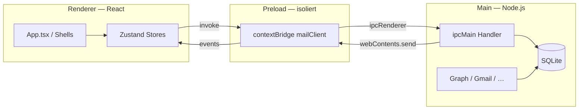
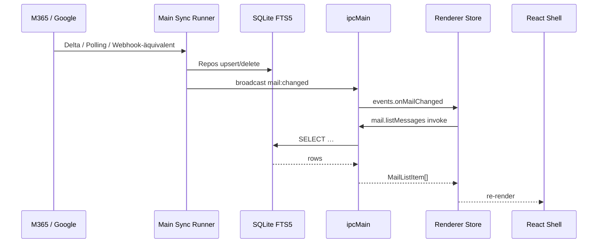

# Chronell — Architektur

Technische Übersicht für Entwickler:innen und Reviewer. Ergänzt [README](../README.md) und [FUNKTIONSPROTOKOLL.md](FUNKTIONSPROTOKOLL.md).

| Dokument | Inhalt |
|----------|--------|
| [IPC-REFERENCE.md](IPC-REFERENCE.md) | Kanal-Liste (generiert) |
| [CONTRIBUTING.md](../CONTRIBUTING.md) | Workflow, Checks, Konventionen |
| [plans/deprecated-cleanup.md](plans/deprecated-cleanup.md) | `@deprecated`-Backlog |

---

## 1. Prozess-Modell (Electron)

Chronell folgt dem klassischen **Electron-Drei-Prozess-Modell** mit strikter Trennung:



| Prozess | Pfad | Verantwortung |
|---------|------|----------------|
| **Main** | `src/main/` | SQLite, Sync, OAuth, IPC-Handler, Hintergrund-Jobs, Fenster |
| **Preload** | `src/preload/` | Typisierte Brücke `window.mailClient`; schlankes `index.ts` + `api/*.ts` + `ipc-listeners.ts` |
| **Renderer** | `src/renderer/` | React-UI, Zustand, keine Secrets / kein DB-Zugriff |
| **Shared** | `src/shared/` | Typen, IPC-Konstanten, reine Domänenlogik (von Main + Renderer importierbar) |

**Sicherheitslinien:** Kein `nodeIntegration` im Renderer; externe URLs nur über `app:open-external`; HTML-Sanitisierung (DOMPurify) für Mail/Compose.

---

## 2. Datenfluss: Sync → SQLite → IPC → UI



### Lokale Datenhaltung

- **Pfad:** `%AppData%/Chronell/data/mail.db` (siehe `getDbPath()` in `src/main/db/index.ts`)
- **Engine:** `better-sqlite3`, WAL-Modus, Migrationen in `src/main/db/schema.ts`
- **Repos:** `src/main/db/*-repo.ts` — schlanke SQL-Schicht, keine ORM
- **Volltext:** FTS5 für Mails (`messages` + `mail_body_index`), Notizen

### Sync & Hintergrund

| Runner | Datei | Aufgabe |
|--------|-------|---------|
| Mail-Polling | `mail-poll-runner.ts` | Ordner-/Nachrichten-Deltas |
| Initial-Sync | `sync-runner.ts` | Erstbefüllung pro Konto |
| Kalender | `calendar-sync-runner.ts` | Graph/Google-Termine |
| Profil-Cloud | `sync-profile/profile-sync-runner-bridge.ts` | Notizen, Verbindungen, Regeln (Supabase) |
| Body-Index | `mail-body-index-runner-bridge.ts` | FTS-Nachindexierung |
| Geplante Mails | `compose-scheduled-runner.ts` | Versand-Queue |

E-Mail-Inhalte werden **nicht** über Profil-Cloud synchronisiert — nur lokal + Provider.

---

## 3. IPC-Konventionen

### Request/Response (`invoke`)

- Kanalnamen zentral in [`src/shared/ipc-channels.ts`](../src/shared/ipc-channels.ts) als `IPC.*`
- Handler in `src/main/ipc/register-<bereich>-ipc.ts`, gebündelt in [`src/main/ipc.ts`](../src/main/ipc.ts)
- Preload mappt auf `window.mailClient.<bereich>.<methode>()`
- Typen für Payloads in `src/shared/types.ts` und domänenspezifischen Modulen

```typescript
// Renderer
await window.mailClient.mail.setRead(messageId, true)

// Preload
setRead: (id, isRead) => ipcRenderer.invoke(IPC.mail.setRead, id, isRead)

// Main
ipcMain.handle(IPC.mail.setRead, async (_e, id, isRead) => { … })
```

### Push-Events (Main → Renderer)

- Main: `webContents.send('mail:changed', payload)` über [`ipc-broadcasts.ts`](../src/main/ipc/ipc-broadcasts.ts)
- Preload: `ipcRenderer.on` + Entkopplung (z. B. `mergeMailChangedPayload`, Debounce 100 ms bei Mail)
- Renderer: `window.mailClient.events.onMailChanged(cb)` → Store lädt neu

Wichtige Events: `mail:changed`, `calendar:changed`, `tasks:changed`, `notes:changed`, `entity-links:changed`, `sync:status`, `profile-sync:status`.

Vollständige Liste: [IPC-REFERENCE.md](IPC-REFERENCE.md).

---

## 4. Renderer-Architektur

### Einstieg & Module

- **Einstieg:** `src/renderer/src/main.tsx` → `App.tsx`
- **Lazy Loading:** Hauptmodule (`CalendarShell`, `MailWorkspace`, …) per `React.lazy` in `App.tsx`
- **Modus:** `useAppModeStore` wählt sichtbare Shell (home, mail, calendar, work, …)

### Feature-Ordner (`src/renderer/src/app/`)

| Ordner | Shell / Fokus |
|--------|----------------|
| `home/` | Dashboard, Kacheln, Mini-Kalender |
| `layout/` | Mail-Workspace, Topbar, Sidebar, ReadingPane, Composer |
| `calendar/` | Kalender-Hauptansicht, Gantt, Termin-Dialog |
| `tasks/` | Microsoft/Google Tasks |
| `notes/` | Lokale Notizen, Kalenderansicht |
| `work/` / `work-items/` | „Alle Arbeit“-Timeline, Work-Items |
| `connections/` | Verbindungs-Graph, KI-Vorschläge |
| `people/` | Kontakte |
| `bookings/` | Microsoft Bookings |
| `files/` | Anhänge & Cloud-Dateien |
| `chat/` | Teams-Chats (Graph) |
| `rules/` | Mail-Regeln & Automation |
| `custom-views/` | Benutzerdefinierte Layout-Ansichten |
| `layout-studio/` | Layout-Editor für Zonen |
| `panel-popout/` | Abgedockte Panel-Fenster |

### State Management

- **Zustand** (`src/renderer/src/stores/`) — kein Redux/React Query
- Große Stores: `mail.ts`, `accounts.ts`, `compose.ts`
- Muster: feingranulare Selektoren, `useShallow` bei Objekt-Arrays
- Persistenz: `localStorage` / dedizierte `*-storage.ts` neben Features

### Shared UI & Lib

- `src/renderer/src/components/` — wiederverwendbare UI (TipTap, Dialoge, …)
- `src/renderer/src/lib/` — Renderer-Helfer (Formatierung, IPC-Logging, Locale)
- `src/shared/` — plattformübergreifende Logik mit Tests

---

## 5. Main-Architektur (Schichten)

```
src/main/
  index.ts              App-Lifecycle, Fenster, Startup-Sync
  ipc.ts                Handler-Registrierung
  ipc/                  register-*-ipc.ts, broadcasts, helpers
  db/                   SQLite + Repos
  graph/                Microsoft Graph
  google/               Gmail, Calendar, Tasks, …
  auth/                 MSAL, Google OAuth
  sync-profile/         Supabase Profil-Sync
  ai/                   KI-Verbindungen, Embeddings
  rule-evaluator.ts     Mail-Regeln (lokal)
  *-runner.ts / *-service.ts
```

**Fehlerlogging:** Hintergrund-Fehler über `logBackgroundError()` (`log-background-error.ts`); Renderer über `logIpcError()` (`lib/ipc-error-log.ts`).

---

## 6. Typen & Verträge

| Datei | Rolle |
|-------|--------|
| `src/shared/ipc-channels.ts` | IPC-Kanalstrings |
| `src/shared/types.ts` | Barrel (Abwärtskompatibilität) → `src/shared/types/*.ts` nach Domäne |
| `src/preload/api/*.ts` | IPC-Brücken pro Bereich (mail, calendar, events, …) |
| `src/shared/*.ts` | Domänenmodule (Parser, Regeln, Meta-Ordner, …) |
| `src/renderer/src/global.d.ts` | `Window.mailClient` API-Typ |

Domänen-Typen liegen unter `src/shared/types/` (`mail.ts`, `calendar.ts`, `compose.ts`, …). Neue Typen dort anlegen; `@shared/types` bleibt als Barrel erhalten.

---

## 7. Build, Bundles & Tooling

- **Build:** `electron-vite` — getrennte Bundles für Main, Preload, Renderer
- **Renderer-Chunks:** FullCalendar, TipTap, Lucide, date-fns (siehe `electron.vite.config.ts` → `manualChunks`)
- **Qualität:** `npm run check` = typecheck + test + lint + i18n + Version
- **Tests:** Vitest (`src/**/*.test.ts`), Coverage: `npm run test:coverage`
- **CI:** `.github/workflows/ci.yml`

---

## 8. Internationalisierung

- `src/renderer/src/locales/de.json` und `en.json`
- `npm run validate:i18n` — gleiche Key-Menge in beiden Dateien
- Datum/Zeit: `@/lib/date-fns-locale` (`useDateFnsLocale`, `resolveDateFnsLocale`)

---

## 9. Bekannte Schwerpunkte & Metriken

| Bereich | Stand | Richtung |
|---------|-------|----------|
| `CalendarShell.tsx` | ~4.000 Zeilen | Schrittweise Hooks/Subkomponenten (Phase 3) |
| `preload/index.ts` | ~70 Zeilen (Barrel) | API in `preload/api/` |
| `shared/types.ts` | Barrel | Domänen-Module unter `shared/types/` |
| E2E (Playwright) | nicht aktiv | erst nach Shell-Split |

---

## 10. Neues Feature — Kurz-Checkliste

1. **Domänenlogik** in `src/shared/` (mit Unit-Test), wenn provider-unabhängig
2. **DB-Zugriff** nur in `src/main/db/`
3. **IPC** Kanal + Handler + Preload + `global.d.ts`
4. **UI** Shell unter `app/<feature>/`, Store nur wenn nötig
5. **i18n** Keys in `de.json` und `en.json`
6. `npm run check` grün vor Merge

Details: [CONTRIBUTING.md](../CONTRIBUTING.md).
