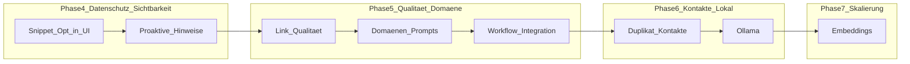
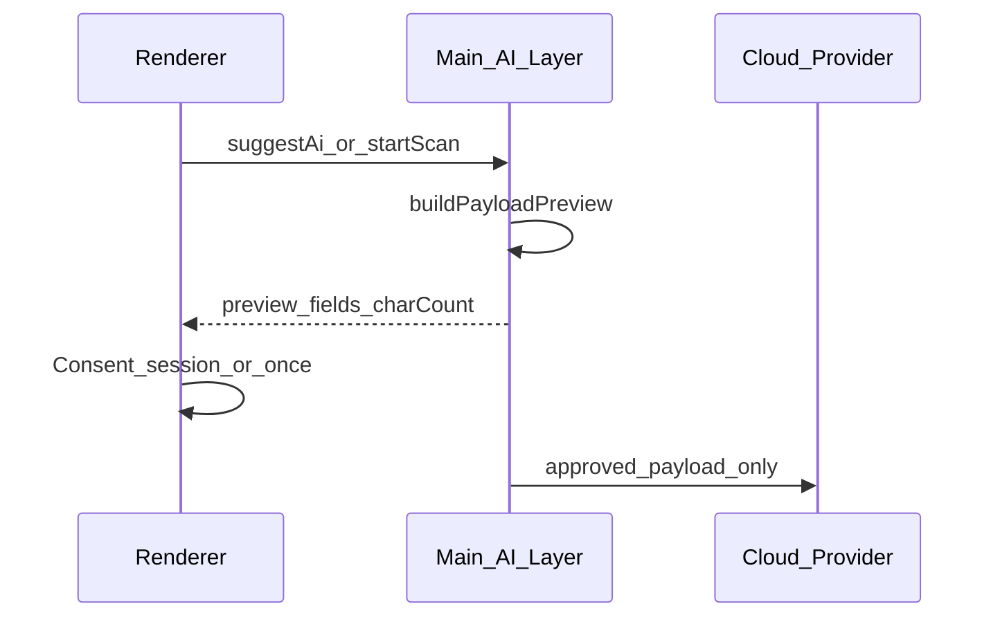
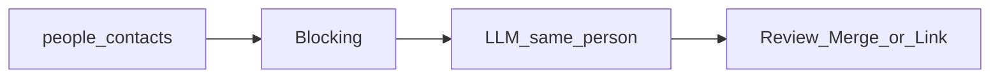
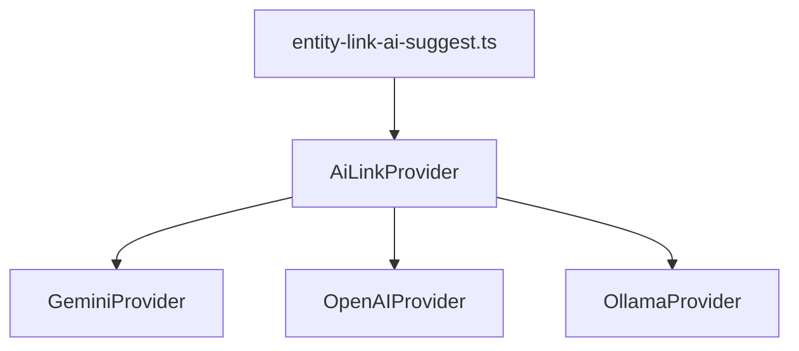
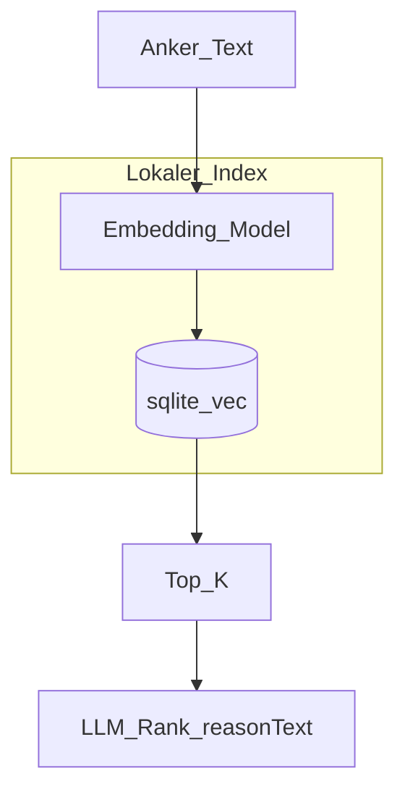

# KI-Verbindungen – Strategischer Plan (Phase 4+)

Stand: Mai 2026 · Chronell (MailClient)

Dieses Dokument beschreibt größere und strategische Erweiterungen der KI-gestützten Objektverknüpfungen. Es ergänzt die bereits umgesetzten Phasen 1–3 (Cloud-KI, Graph-Scan, Snippet-Basis, Ketten, Scan-Profile, Provider-Vergleich, Dichte-Dashboard usw.).

**Grundprinzipien (unverändert):**

- Kein automatisches Speichern von KI-Links – Nutzer bestätigt jede Verbindung.
- Standard: nur Metadaten an die Cloud; Volltext/Anhänge nie ohne expliziten Consent.
- API-Keys im Secure Store; Einstellungen und verworfene Vorschläge in der Settings-Sicherung.

---

## Ausgangslage (Ist)

| Bereich | Status |
|--------|--------|
| Cloud-Provider | Gemini, OpenAI (`src/main/ai/`, `src/shared/ai-connections.ts`) |
| Vorschläge / Scan | `entity-link-ai-suggest.ts`, `entity-link-ai-scan.ts` |
| Kandidaten-Retrieval | Heuristisch: Zeitfenster, Domain, Betreff-Tokens, 1-Hop (`entity-link-ai-retrieval.ts`) |
| Snippet (technisch) | `includeSnippet` + `snippetConsentGiven`, `excerptPlainText()` max. 500 Zeichen (`entity-link-ai-excerpt.ts`) |
| UI | `ConnectionsPanel`, `ConnectionsAiScanPanel`, `ConnectionsShell`, Einstellungen `SettingsAiConnectionsSection` |

**Lücke Snippet Phase 3:** Consent in Einstellungen vorhanden, aber keine granulare Vorschau pro Aufruf, kein Unterschied Vorschauzeile vs. Body in der UI.

### R4 Umsetzungsstand (Mai 2026)

| Paket | Status |
|-------|--------|
| 1.1 Payload-Preview-API | Erledigt (`entity-link-ai-payload-preview.ts`, IPC `previewAiPayload`) |
| 1.2 Quellen-Matrix / Vorschauzeile vs. Body | Erledigt (`resolveMailTextExcerpt`, Quellen-Labels in UI) |
| 1.3 `snippetMode` off/on/ask | Erledigt (`ai-connections.ts`, Einstellungen) |
| 1.4 Scan-Dialog Vorschau | Erledigt (`ConnectionsAiScanPanel`, `AiSnippetConsentDialog`) |
| 1.5 Einzelvorschlag Modal + Session | Erledigt (`ConnectionsPanel`, `ai-snippet-session.ts`) |
| 1.6 Audit-Log | Offen |
| 2 Proaktive Hinweise Phase A | Erledigt (heuristisch, Graph-Badge, Cache) |
| 2b Proaktive Hinweise Phase B | Erledigt (Scan-Cache + Panel-KI, Mail-Liste-Badge, Quelle im Tooltip) |
| 1.6 Audit-Log | Erledigt (`entity_link_ai_audit`, Einstellungen-Übersicht) |
| 5 Workflow-Integration | Kern erledigt (`WorkflowBoard` in `WorkShell` Ansicht „Workflow“, Threads via `WorkflowThreadBlock`, Mail-Kontext „Verbindungen mit KI prüfen“) |
| R5 Domänen-Prompts | Erledigt (Built-in + Einstellungen, Scan + Panel) |
| R5 Link-Qualität | Erledigt (IPC, Panel, Graph-Kanten mit Einstellungs-Toggle) |
| Graph-KI Auto-Scan | Erledigt (Kontextmenü startet Scan nach Panel-Öffnen) |
| 7 Ollama (MVP) | Erledigt (Provider `ollama`, `/api/chat` + `/api/tags`, Modellauswahl in Einstellungen) |
| 8 Embeddings | Erledigt (SQLite `entity_embeddings`, Ollama `/api/embed`, Hybrid-Retrieval, Hintergrund nach Sync, Einstellungen) |

---

## Roadmap-Übersicht



| Priorität | Thema | Aufwand grob | Nutzen |
|-----------|--------|--------------|--------|
| 1 | Snippet-Opt-in (Phase 3 fertig) | M (3–5 Tage) | Hoch |
| 2 | Proaktive Hinweise | M (1–2 Wochen) | Hoch |
| 3 | Verbindungs-Qualität | L (1–2 Wochen) | Mittel |
| 4 | Domänen-Prompts | M (~1 Woche + Custom) | Hoch |
| 5 | Workflow-Integration | S–M (3–5 Tage) | Hoch |
| 6 | Duplikat-Kontakte | L (2–3 Wochen) | Mittel |
| 7 | Ollama (lokal) | XL (2–3 Wochen) | Hoch (Nische) |
| 8 | Embeddings | XL (6–10 Wochen) | Sehr hoch (langfristig) |

**Empfohlene Release-Pakete:**

- **R4 – Vertrauen & Sichtbarkeit:** Snippet-UI, proaktive Hinweise (A+B), Workflow-Integration
- **R5 – Intelligenz & Domäne:** Domänen-Prompts, Link-Qualität, Duplikat-Kontakte
- **R6 – Souveränität & Skalierung:** Ollama, Embeddings (8.1–8.3)

---

## Querschnitt: gemeinsame Grundlagen

Diese Bausteine einmal bauen, von mehreren Features nutzen:

| Baustein | Nutzen für |
|----------|------------|
| `AiLinkProvider`-Interface | Ollama, weitere Anbieter |
| `entity-link-ai-prompts.ts` (neu, Prompts aus `entity-link-ai-suggest.ts` extrahieren) | Domänen, Qualität, Ketten |
| `ai_suggestion_cache` + IPC-Events | Proaktive Hinweise, Mail-Liste |
| `buildAiLinkPayloadPreview()` | Snippet-Opt-in, optionales Audit |
| Einheitliche `EntityLinkAiJob`-Queue | Scan, Hintergrund-Badges, keine parallelen API-Stürme |

---

## 1. Snippet-Opt-in (Phase 3 – vollständige UI)

### Ziel

Nutzer sieht **vor jedem sensiblen Aufruf**, welcher Text die Cloud verlässt – mit klarer Datenschutz-UI. Kein Volltext, keine Anhänge.

### Architektur



### Arbeitspakete

| ID | Inhalt | Betroffene Dateien |
|----|--------|-------------------|
| 1.1 | Payload-Preview-API | Neu: `entity-link-ai-payload-preview.ts`; IPC in `register-entity-links-ipc.ts`, `ipc-channels.ts`, `preload/index.ts` |
| 1.2 | Quellen-Matrix pro `EntityRefKind` | `entity-link-ai-excerpt.ts`, `entity-link-ai-context.ts` |
| 1.3 | Einstellungen: `snippetMode: off \| on \| ask` | `ai-connections.ts`, `ai-settings-store.ts`, `SettingsAiConnectionsSection.tsx` |
| 1.4 | Scan-Dialog mit Vorschau + Beispiel-Excerpt | `ConnectionsAiScanPanel.tsx` |
| 1.5 | Einzelvorschlag: Modal vor erstem KI-Laden; Session-Flag | `ConnectionsPanel.tsx` |
| 1.6 | Optional: lokales Audit (Zeit, Anker-Titel, Zeichen, Provider – **ohne** Inhalt) | Neue SQLite-Tabelle `ai_link_audit` |
| 1.7 | i18n DE/EN: was nie gesendet wird | `locales/de.json`, `locales/en.json` |

### Akzeptanzkriterien

- Ohne Consent sendet kein Codepfad Excerpts (Tests pro Entry-Point).
- Excerpt bleibt ≤ 500 Zeichen, HTML gestripped.
- Vorschau vor erstem Scan und vor erstem Einzelvorschlag sichtbar.

---

## 2. Proaktive Hinweise (Badge, kein Auto-Speichern)

### Ziel

„3 KI-Vorschläge“ am Graph-Knoten oder in der Mail-Liste – **ohne** automatisches Anlegen von Links.

### Datenmodell (Vorschlag)

```sql
-- ai_suggestion_cache
anchor_key TEXT PRIMARY KEY,
count INTEGER NOT NULL,
top_targets_json TEXT,  -- optional, max 3 für Tooltip
computed_at TEXT NOT NULL,
stale_after TEXT
```

Invalidierung bei: `entity-links:changed`, neuer Mail, Dismiss, manueller Link.

### UI

| Ort | Verhalten |
|-----|-----------|
| Graph-Knoten | Badge; Klick öffnet Panel/Scan mit Anker |
| Mail-Liste | Sparkles + Zahl (nur gecachte Anker) |
| Reading Pane | Optional im `ConnectionsPanel`-Header |

### Phasen

- **A:** Zähler nur aus heuristischen Vorschlägen (kein LLM) – schnell, datenschutzfreundlich
- **B:** Zähler aus gecachtem letztem KI-Scan / „KI laden“
- **C:** Opt-in Idle-Update (Settings: max. N Aufrufe/Tag)

### Aufwand

Phase A: ~3 Tage; A+B: ~1–2 Wochen.

---

## 3. Verbindungs-Qualität (bestehende Links)

**Umsetzungsstand (R5):** IPC `evaluateLinkQuality`, Session-Cache, Panel + Graph-Kanten (`showLinkQualityOnGraph` in Einstellungen), Audit `evaluate_quality`.

### Ziel

KI bewertet **bestehende** Kanten: z. B. `strong` | `moderate` | `weak` | `questionable` + `reasonText` – keine Auto-Löschung.

### API

- Neuer Modus: `evaluateLinks(anchor)` → alle Peers von `listEntityLinksForAnchor` + Snapshots
- Output analog zu Vorschlägen, Feld `quality` statt neuer `target`

### UI

- Graph: Kantenstärke/-farbe (Settings-Toggle)
- Panel: „Qualität bestehender Verbindungen“, Filter „nur wackelige“
- Aktionen: entfernen, optional `linkKind: confirmed`

### Persistenz

- Zuerst Session-Cache; bei Bedarf Migration `entity_links.quality_score`

---

## 4. Domänen-Prompts (Scan-Modi)

**Umsetzungsstand (R5):** `entity-link-ai-prompts.ts`, Built-in `general` / `workshop_honorar` / `travel`, benutzerdefinierte Profile in Einstellungen, Retrieval-Boost per Stichwörtern, Domänen-Dropdown im Scan-Panel und Vorschlags-Panel.

### Ziel

Wählbare Profile z. B. „Workshop/Honorar“, „Reise“, „Projekt X“ mit angepasstem Prompt und Retrieval.

### Modell

```ts
type AiLinkDomainProfile = {
  id: string
  labelKey: string
  retrievalBoost?: { kinds?; subjectKeywords? }
  systemPromptAddon: string
}
```

### Built-in-Beispiele

| Profil | Retrieval-Fokus | Prompt-Fokus |
|--------|-----------------|--------------|
| Workshop/Honorar | Workshop, Honorar, Vortrag | Person ↔ Termin ↔ Rechnungs-Mail |
| Reise | Flug, Hotel, Bahn | Buchungs-Mail ↔ Termin ↔ Anbieter-Kontakt |
| Projekt X | Nutzer-Stichwörter (Settings) | Projektbezogene Verknüpfungen |

### UI

- Scan-Panel: Dropdown „Domäne“ neben `scanProfile`
- Einstellungen: benutzerdefinierte Profile (Name + Stichwörter)

### Dateien

- Neu: `entity-link-ai-prompts.ts`
- Erweitern: `entity-link-ai-scan.ts`, `ConnectionsAiScanPanel.tsx`

---

## 5. Workflow-Integration

**Stand:** Modul **Alle Arbeit** → Ansicht **Workflow** rendert `WorkflowBoard` (Kanban-Spalten + `WorkflowThreadBlock` + `ReadingPane`). Persistenz: `mailclient.work.contentViewMode.v1` = `workflow`.

### Ziel

Aus Workflow-Thread: **„Verbindungen mit KI prüfen“**.

### Flow

1. Thread → `messageIds[]` → `ChronellEntityRef` pro Mail
2. `openConnectionsGraph` / Scan mit `anchors`
3. Bei >10 Mails: nur letzte 10 als Anker

### Arbeitspakete

| ID | Inhalt |
|----|--------|
| 5.1 | Kontextmenü in `WorkflowThreadBlock.tsx` (+ Parent) |
| 5.2 | `connections-graph-focus` / Shell: `openScan: true` mit Ankern |
| 5.3 | Optional: kompakte Ergebnisliste im Workflow ohne Modulwechsel |

### Aufwand

Kern: 3–5 Tage.

---

## 6. Duplikat-Kontakte zusammenführen

### Ziel

Semantisch ähnliche Kontakte als **Vorschlag** (Review), kein automatischer Merge.

### Pipeline



- **Phase 1 (heuristisch):** gleiche E-Mail, ähnlicher Name + Firma, gleiche Domain
- **Phase 2 (LLM):** Paare aus Blocking, Output `merge` | `link` + confidence

### Kritisch

Bei Merge: alle `entity_links` und Referenzen auf surviving `contactId` migrieren (`people-repo`, `entity-links-repo`).

---

## 7. Lokales Modell (Ollama)

**Stand (MVP):** Einstellungen → KI-Verbindungen → **Ollama (lokal)**; Basis-URL; Modellliste `/api/tags`; **Verbindung testen** (Server + optional Modell-JSON-Ping); Vorschläge/Qualität via `/api/chat`. **Kompakt-Prompts** automatisch für kleine Ollama-Modelle (≤12B, z. B. `llama3.2`, `qwen2.5:7b`). Offen: Offline-Fallback, expliziter Kompakt-Schalter.

### Ziel

Strenge Datenschutz-Anforderungen ohne Cloud.

### Architektur



### Arbeitspakete

- HTTP-Client: `POST /api/chat`, Base-URL konfigurierbar, Modell-Liste `/api/tags`
- Einstellungen: Provider `ollama`, Verbindungstest, Timeout
- Kürzere Prompts / weniger Kandidaten für kleine Modelle
- Offline: Fallback auf heuristische Vorschläge

### Abhängigkeit

Provider-Abstraktion (2.1) **vor** Embeddings sinnvoll; unabhängig von Snippet-UI.

### Aufwand

~2–3 Wochen inkl. Tests mit 2–3 Modellen.

---

## 8. Embeddings (langfristig)

**Stand (Mai 2026):** Kapitel 8 umgesetzt — `entity_embeddings` (Migration v41), `entity-embedding-text.ts`, `ollama-embeddings.ts` (`/api/embed`), `entity-embeddings-index.ts` (Rebuild + Delta-Queue nach Mail-Sync), `entity-embeddings-search.ts` (Hybrid + Kosinus), `entity-link-embedding-suggest.ts` (schnelle Vorschläge `embedding_semantic`), LLM-Kandidaten max. 15 bei aktivem Index. Einstellungen: Vektorindex, Modell, Hybrid/Auto/Fast, „Index neu aufbauen“.

### Ziel

Lokale Vektorsuche für Kandidaten; LLM nur noch für Ranking und `reasonText` (günstiger, skalierbarer).



### Index-Inhalt (pro Entity)

`title + subtitle + subject + participants + lokaler excerpt` – Embedding lokal (z. B. `nomic-embed-text` via Ollama oder `@xenova/transformers`).

### Phasen

| Phase | Inhalt |
|-------|--------|
| 8.1 | Embedding-Pipeline bei Mail-Sync / Notiz-Save |
| 8.2 | Hybrid-Retrieval in `entity-link-ai-retrieval.ts` |
| 8.3 | LLM nur Top-15 statt Top-40 (~60 % Token-Reduktion) |
| 8.4 | Inkrementeller Index, Rebuild-Job |
| 8.5 | Optional: Re-Ranking für Link-Qualität (Thema 3) |

### Technologie-Optionen

- **sqlite-vec** (passt zu bestehender SQLite in `src/main/db/`)
- Modell-Download on-demand in Einstellungen (100–400 MB)

### Aufwand

~6–10 Wochen.

---

## Nicht-Ziele

- Kein Auto-Speichern von KI-Links
- Kein Volltext-Upload ohne expliziten Snippet-Consent
- Kein automatisches Kontakt-Merge ohne Bestätigung
- Kein Hintergrund-Scan als Default (nur opt-in bei proaktiven Hinweisen Phase C)

---

## Nächste Schritte (empfohlen)

1. **Snippet-Opt-in UI** (1.3–1.5) – schneller Nutzen, geringes Architektur-Risiko  
2. **Workflow-Integration** (5) – sichtbar im Alltag  
3. **Provider-Abstraktion** – Voraussetzung für Ollama  
4. **Domänen-Prompts** – baut auf bestehendem Scan auf  

---

## Verwandte Dokumentation

- Implementierung Phasen 1–3: Cursor-Plan (lokal `.cursor/plans/`, nicht versioniert)
- Funktionsprotokoll: [`docs/FUNKTIONSPROTOKOLL.md`](../FUNKTIONSPROTOKOLL.md)
- Hauptcode KI-Verbindungen: [`src/main/ai/`](../../src/main/ai/), [`src/shared/ai-connections.ts`](../../src/shared/ai-connections.ts)
